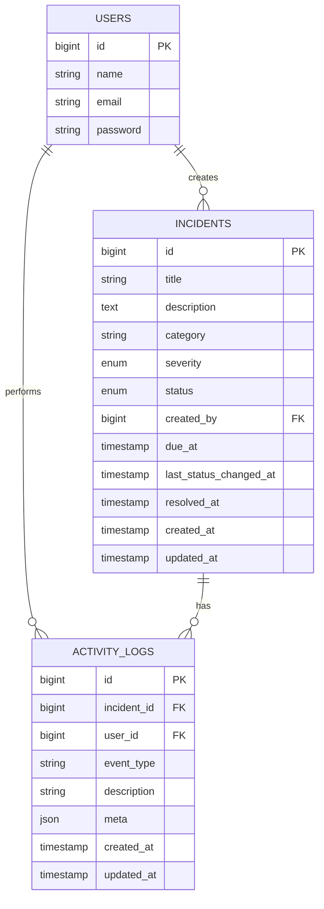
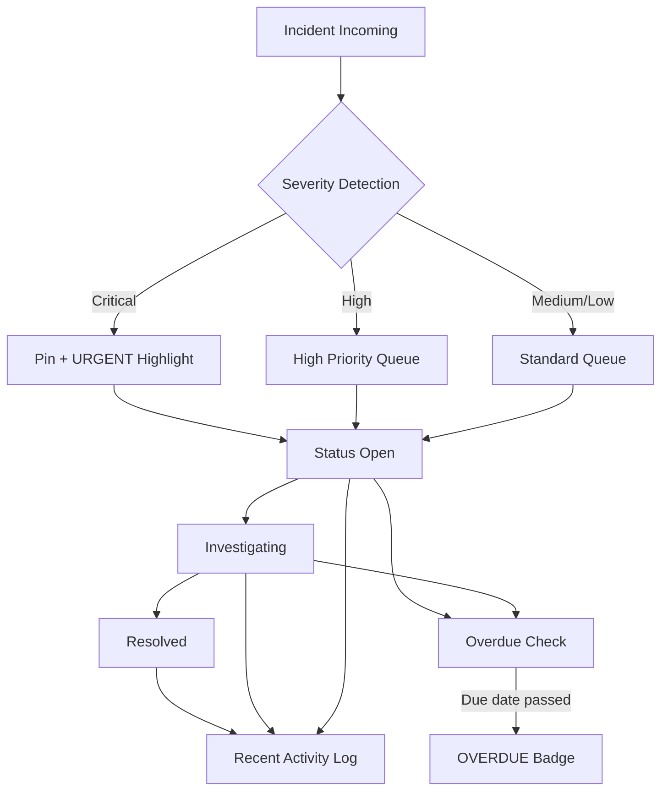

# Operational Attention Monitoring System MVP

Operational dashboard MVP to help teams detect anomalies quickly, prioritize incidents by severity, and respond to critical problems first.

## Stack

- Laravel 12
- MySQL
- Blade
- Tailwind CSS
- Laravel Breeze (auth)

## Core Value

- Attention-first dashboard
- Severity prioritization (Critical -> High -> Medium -> Low)
- Fast triage workflow (Open -> Investigating -> Resolved)
- Activity timeline for operational visibility

## Feature Coverage

- Authentication: login, register, logout
- Incident Management: create, read, update, delete
- Severity prioritization logic and urgency highlight
- Monitoring dashboard with critical alert, summary cards, queue, trend, recent activity
- Filtering by severity, status, category, date
- Badge logic: URGENT, OVERDUE
- Pinned critical incident

## Folder Structure (Clean + Scalable)

- app/Enums
- app/Http/Controllers
- app/Http/Requests
- app/Models
- app/Services
- resources/views/dashboard.blade.php
- resources/views/incidents

Design intention:

- Enum keeps domain constants centralized
- FormRequest isolates validation rules
- Service layer isolates priority and activity logic
- Controllers focus on orchestration
- Blade layer focuses on presentation

## Database Design

### incidents

- id
- title
- description
- category
- severity (critical|high|medium|low)
- status (open|investigating|resolved)
- created_by (FK -> users.id)
- due_at
- last_status_changed_at
- resolved_at
- created_at
- updated_at

### activity_logs

- id
- incident_id (FK -> incidents.id, nullable)
- user_id (FK -> users.id, nullable)
- event_type
- description
- meta (json)
- created_at
- updated_at

## ERD



## Workflow Flowchart



## Route Map

- GET /dashboard
- Resource /incidents
- Breeze auth routes in routes/auth.php

## Severity Prioritization

Sorting strategy:

1. Severity descending: Critical, High, Medium, Low
2. Status order: Open, Investigating, Resolved
3. Latest created

Attention rules:

- URGENT if severity critical/high and status not resolved
- OVERDUE if due_at < now and status not resolved
- Pinned critical section for top critical open incident

## How To Run

1. Configure .env for MySQL incident_monitoring database
2. Run:

```bash
composer install
npm install
php artisan key:generate
php artisan migrate
php artisan db:seed
npm run dev
php artisan serve
```

Sample credentials after seeding:

- email: test@example.com
- password: password

## Presentation Strategy (Assessment)

1. Explain this is not a plain CRUD app:
    - CRUD simulates incoming operational incidents
    - Architecture prepared for future integration (logs, sensors, APIs)

2. Show attention logic first:
    - Pinned critical
    - URGENT and OVERDUE badges
    - Priority queue ordering

3. Demonstrate workflow:
    - Open -> Investigating -> Resolved
    - Activity timeline captures important events

4. Demonstrate scalability decisions:
    - Service layer for business logic
    - Enum for domain consistency
    - FormRequest for validation consistency

## Small But Impactful Enhancements

- Add SLA breach countdown (minutes to due)
- Add assignee column and ownership filter
- Add export CSV for filtered incidents
- Add chart for resolved vs open per day
- Add incident aging indicator (hours open)

## Recruiter/Mentor Evaluation Checklist

- Product thinking: attention-first UX, not data dump
- Technical structure: MVC clean, maintainable layers
- Domain modeling: severity and workflow are explicit
- Usability: key issue visible in less than 5 seconds
- Extensibility: easy to integrate with real incident sources

## Next Step To Production

- Add role/permission (analyst, manager, admin)
- Add API endpoints for ingestion from monitoring tools
- Add notification channels (email/Slack/Webhook)
- Add queue + jobs for anomaly ingestion
- Add test suite for priority logic and workflow rules
